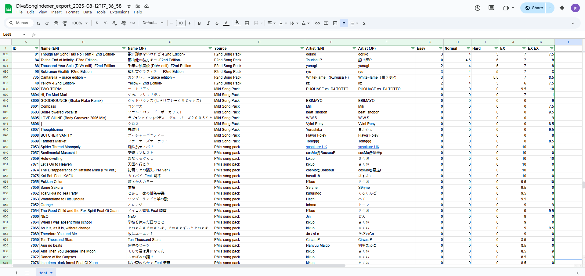

---

DivaSongIndexer is a small utility to export modded song information for Hatsune Miku: Project DIVA Mega Mix+ into a human-readible index (CSV file)

## Prerequisites
Make sure you have **version 6.0 or greater** of the .NET Runtime from Microsoft installed: https://dotnet.microsoft.com/en-us/download

NOTE: You may already have this installed if you use [TekkaGB's DivaModManager](https://github.com/TekkaGB/DivaModManager)

## Usage
- Download the latest version from the [Releases](https://github.com/jd-274/DivaSongIndexer/releases) page
- Extract its contents to any location on your computer
- Launch the executable. A small window will prompt you for the "mods" folder that contains your Project DIVA Mega Mix+ mods, as specified by your [DIVA Mod Loader configuration file](https://github.com/blueskythlikesclouds/DivaModLoader?tab=readme-ov-file#configuration-file)
  - This directory is usually in a location such as: `C:\Program Files\SteamLibrary\steamapps\common\Hatsune Miku Project DIVA Mega Mix Plus\mods`
- Click the "Create Song Index" button. This will prompt you for an "output" folder where the index will finally be saved

## Output Example
The generated index will be a CSV file that can be opened on most spreadsheet programs. It will contain several relevant columns of data including the PV ID, Song Name, Source (Mod Name), Artist Name, and the available Song Difficulties

## Feedback
I hope to keep improving this project with input from the community. If you find any bugs, have some ideas, or just want to send some thanks, the best ways to do this are:
- [Github Issue](https://github.com/jd-274/DivaSongIndexer/issues) 
- [Google Form](https://docs.google.com/forms/d/e/1FAIpQLScFRVfX3Qmh8JQG0CdcE6ihMRo-U1KtoIkJU_96TDJgtvb9Xg/viewform?usp=dialog) (allows anonymous submissions)

And if you like the project, consider leaving a star or [supporting me](https://ko-fi.com/jd274)!

## Credits
- Licensing for all third party libraries can be found under the [THIRD-PARTY-LICENSES.txt](THIRD-PARTY-LICENSES.txt) file.
- All instances of the "Tako Luka with Notepad" art were used with permission from the artist, [StukPixel](https://ko-fi.com/stukpixel), for this project. All rights to this artwork are reserved by the artist.
- And a special thanks to all of the friends I've made in the Project DIVA Mega Mix+ community. This project would have not been possible without your support.